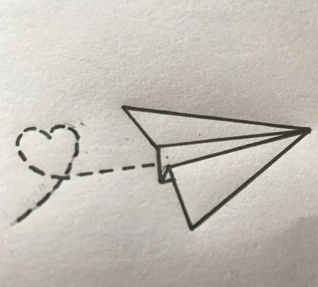
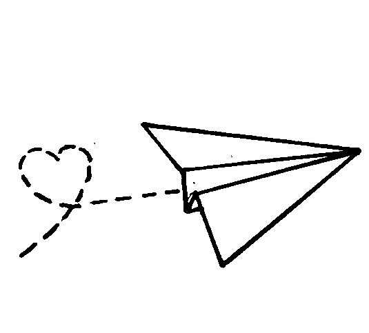

# Remove Background

This is a simple program that takes an input image and outputs a new image, where pixels are either black or transparent.

## Example
|  |  |
|------------------------------------|---------------------------------------------------|
| input folder image(s)              | output folder image(s)                            |
